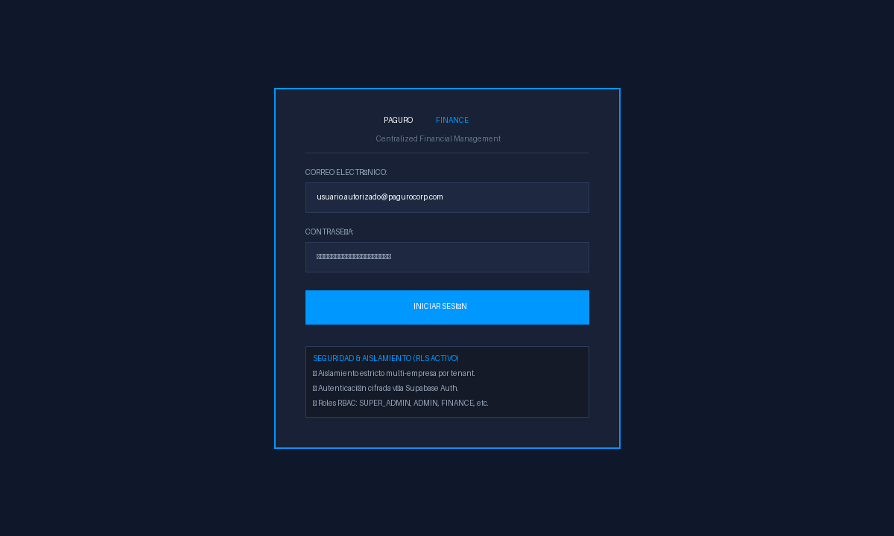
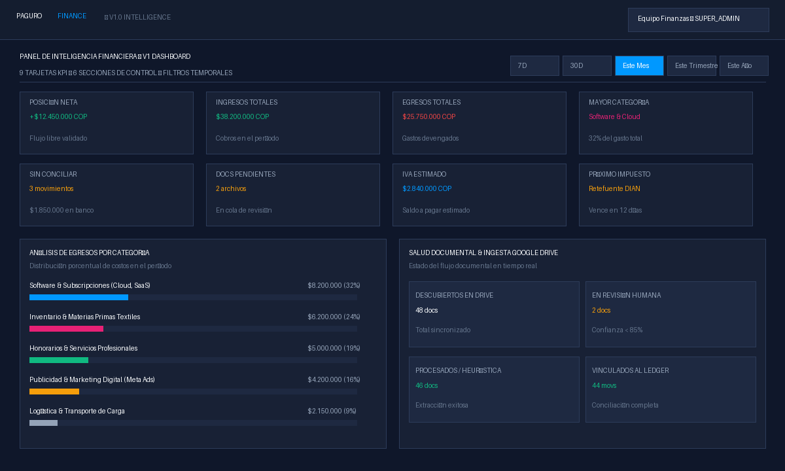
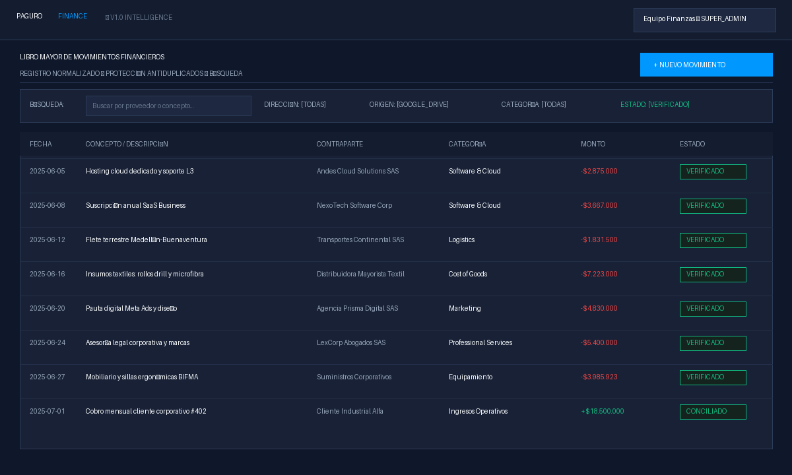
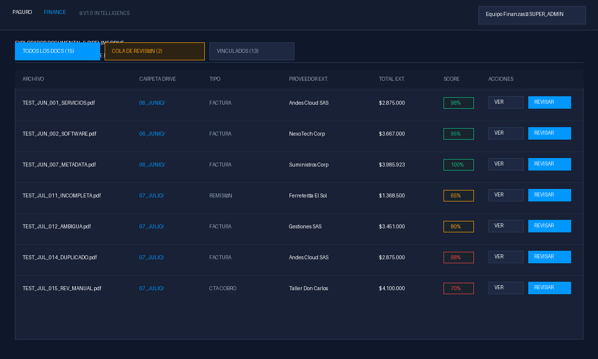
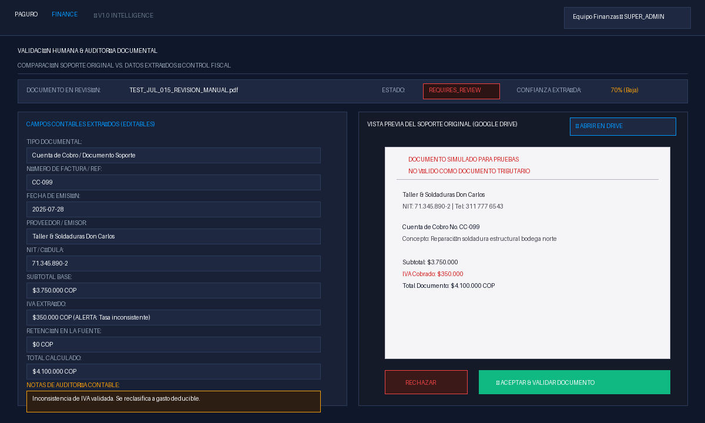
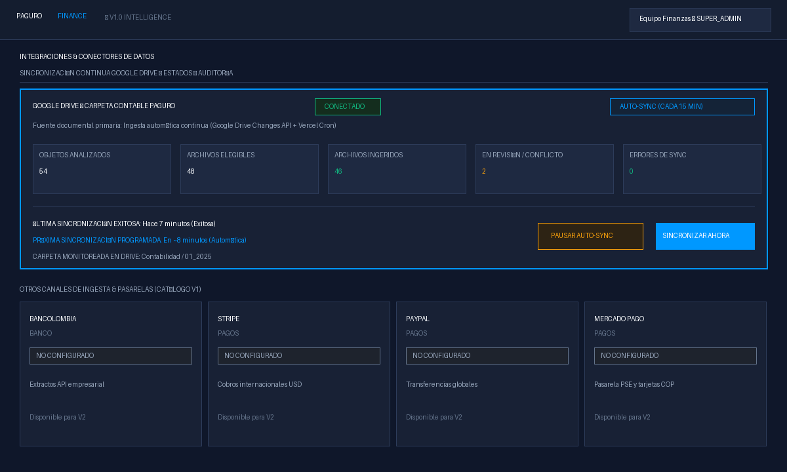
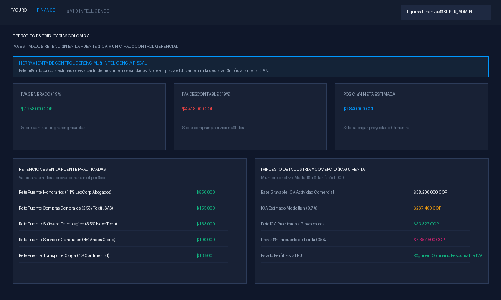
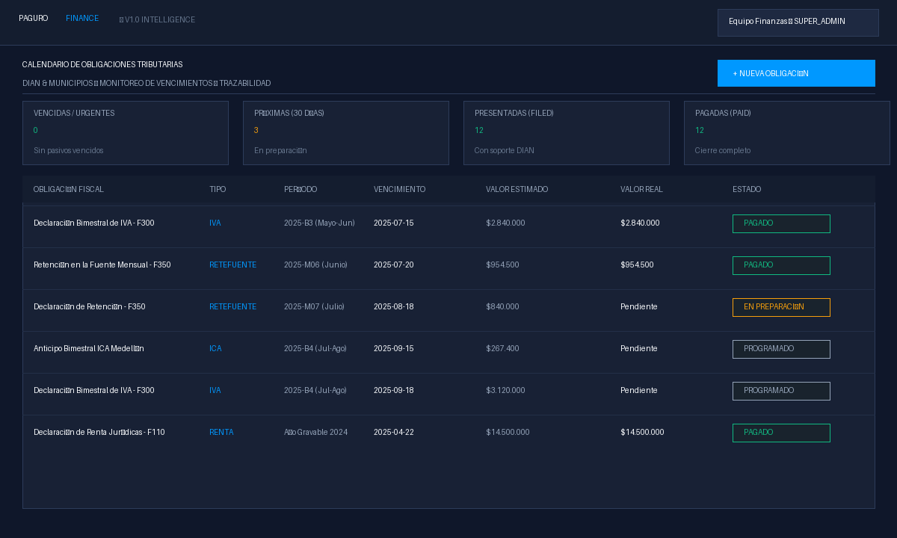
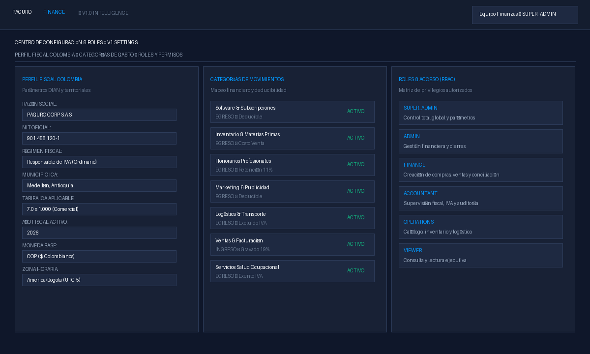

# PAGURO FINANCE V1
## Manual Oficial de Operaciones & Procedimiento Operativo Estándar (SOP)

**Versión del Sistema:** 1.0 (Financial Intelligence & Documentary Operations)  
**Audiencia:** Equipo Contable, Financiero, Administrativo y Operativo (Usuarios No Técnicos)  
**Fecha de Vigencia:** Año Fiscal Activo (2025 - 2026)  
**Clasificación:** Confidencial — Documento Operativo Interno  

---

## 1. ¿Qué es Paguro Finance V1?

**Paguro Finance** es el sistema central de gestión financiera y contable diseñado a la medida para las operaciones de Paguro. Su objetivo principal es unificar, ordenar y transparentar toda la información de compras, ventas, soportes tributarios, extractos bancarios y movimientos de caja en un único panel de control confiable.

En la operativa diaria de una empresa, las facturas y los comprobantes suelen dispersarse en correos electrónicos, carpetas compartidas y chats. **Paguro Finance V1 resuelve esto conectando directamente los documentos de soporte con los movimientos contables reales.**

### Canales de Entrada de Información
Toda la información financiera ingresa al sistema a través de dos caminos independientes pero coordinados:

1. **Sincronización Automática de Google Drive:** El sistema monitorea continuamente la estructura oficial de carpetas contables en la nube. Cada vez que el equipo deposita una factura electrónica en PDF, una cuenta de cobro o un comprobante bancario, Paguro Finance lo detecta automáticamente sin intervención manual.
2. **Entrada Manual de Movimientos:** Para transacciones de caja menor, pagos urgentes, transferencias directas o compras sin soporte digital inmediato, los analistas pueden registrar movimientos directamente desde el portal web.

### Diagrama del Flujo General del Sistema

```
┌────────────────────────────────┐         ┌────────────────────────────────┐
│   GOOGLE DRIVE (AUTOMÁTICO)    │         │     ENTRADA MANUAL (USUARIO)   │
│   Carpetas mensuales en la nube│         │     Gastos de caja, ad-hoc     │
└───────────────┬────────────────┘         └───────────────┬────────────────┘
                │                                          │
                ▼                                          │
   ┌───────────────────────────┐                           │
   │    Ingesta Documental     │                           │
   │  (Detección cada 15 min)  │                           │
   └────────────┬──────────────┘                           │
                ▼                                          │
   ┌───────────────────────────┐                           │
   │ Clasificación & Extracción│                           │
   │  Heurística determinista  │                           │
   └────────────┬──────────────┘                           │
                ▼                                          │
   ┌───────────────────────────┐                           │
   │  ¿Confianza < 85% o duda? │─── SÍ ───┐                │
   └────────────┬──────────────┘          │                │
               NO                         ▼                │
                │              ┌─────────────────────┐     │
                │              │   REVISIÓN HUMANA   │     │
                │              │   (Cola de Control) │     │
                │              └──────────┬──────────┘     │
                ▼                         │                │
   ┌───────────────────────────┐          │                │
   │    Validación Formal      │◄─────────┘                │
   └────────────┬──────────────┘                           │
                │                                          │
                └─────────────────────┬────────────────────┘
                                      ▼
                      ┌────────────────────────────────┐
                      │      MOVIMIENTO FINANCIERO     │
                      │    (Libro Mayor Normalizado)   │
                      └───────────────┬────────────────┘
                                      ▼
     ┌──────────────────────────────────────────────────────────────────┐
     │           MÓDULOS DE CONTROL GERENCIAL & DECISIÓN                │
     │  • Dashboard de KPIs   • Liquidación de IVA   • Auditoría Fiscal │
     │  • Calendario DIAN     • Conciliación Bancos  • Reportes         │
     └──────────────────────────────────────────────────────────────────┘
```

### Invariantes Fundamentales de Operación
* **Google Drive es intocable:** Paguro Finance solo lee los documentos en la nube; **jamás** modifica, renombra, mueve ni borra los archivos originales de Google Drive.
* **El criterio humano tiene la máxima autoridad:** Los datos confirmados por un usuario (`USER_VERIFIED`) nunca son sobreescritos por sincronizaciones automáticas.
* **Trazabilidad total:** Cada cambio, validación o reclasificación queda firmado con el nombre del usuario, la fecha y la hora exacta.

---

## 2. Inicio de Sesión, Acceso y Aislamiento de Datos

### QUÉ ES
Es la puerta de entrada segura al sistema que garantiza que únicamente el personal autorizado tenga acceso a las cifras financieras de la empresa.

### PARA QUÉ SIRVE
* Proteger la confidencialidad de la información bancaria y tributaria.
* Aplicar los permisos correspondientes según el cargo del colaborador (Finanzas, Contabilidad, Operaciones, Dirección).
* Asegurar que los datos de una empresa no se mezclen bajo ninguna circunstancia con otra.

### CAPTURA VISUAL DE LA PANTALLA

> *[CAPTURA: 01_login.png - Pantalla de inicio de sesión oficial con credenciales y verificación de aislamiento RLS.]*

### ¿Qué significa "Aislamiento de Datos" y "RLS" en lenguaje sencillo?
En Paguro Finance utilizamos una regla de seguridad estricta llamada **Row Level Security (RLS)**.  
*En términos sencillos:* Imagina que el sistema es un edificio corporativo con oficinas selladas. Tu usuario solo tiene llave para la oficina de tu empresa. Aunque otro usuario inicie sesión en la misma plataforma para otra entidad, la base de datos garantiza automáticamente que sea matemáticamente imposible que un usuario vea facturas, clientes o balances que no pertenezcan a su organización activa.

### PASO A PASO: Cómo Iniciar Sesión
1. Abre tu navegador web (Google Chrome, Microsoft Edge o Brave) e ingresa a la dirección oficial de la plataforma:  
   `http://localhost:3000/login` (o la URL de producción proporcionada por tu administrador).
2. En la casilla **Correo Electrónico**, escribe tu correo corporativo asignado.
3. En la casilla **Contraseña**, escribe tu clave personal de acceso.
4. Haz clic en el botón azul **Iniciar Sesión**.
5. Si tus credenciales son correctas, el sistema te redirigirá automáticamente al **Dashboard Principal**.

### ¿Qué sucede si el usuario no tiene permisos?
Si intentas acceder a un módulo restringido para tu rol (por ejemplo, si un rol *Viewer* intenta borrar una categoría o un rol *Operations* intenta entrar al módulo fiscal de impuestos), la aplicación mostrará un mensaje claro:  
`"Acceso Denegado: Tu perfil no cuenta con permisos suficientes para realizar esta acción"`. En este caso, debes solicitar autorización a tu líder de área o al Administrador Financiero.

### ERRORES COMUNES EN EL ACCESO
| Error Visualizado | Causa Frecuente | Solución Práctica |
|---|---|---|
| `Credenciales inválidas` | Correo mal escrito o contraseña errónea. | Verifica mayúsculas/minúsculas y escribe la clave nuevamente. |
| `El enlace ha caducado` | La sesión estuvo inactiva por más de 24 horas. | Actualiza la página e inicia sesión desde cero. |
| `Sin empresa activa asignada` | El usuario fue registrado pero no vinculado a la empresa. | Contacta a tu SUPER_ADMIN para que vincule tu correo en Configuración → Usuarios. |

---

## 3. Dashboard / Panel de Inteligencia Financiera

### QUÉ ES
Es la pantalla principal de mando gerencial. Condensa en tiempo real la salud de la caja, las ventas, los gastos del mes, la situación con los bancos y los compromisos tributarios pendientes.

### CAPTURA VISUAL DEL DASHBOARD

> *[CAPTURA: 02_dashboard.png - Vista general del Dashboard con sus 9 tarjetas KPI y paneles de control.]*

### Filtros Temporales Disponibles
En la esquina superior derecha del panel encontrarás 5 botones de corte:
* **7D (Últimos 7 días):** Para control semanal de tesorería inmediata.
* **30D (Últimos 30 días):** Visión móvil de los últimos 30 días de operación.
* **Este Mes (Predeterminado):** Muestra los datos desde el día 1 del mes en curso hasta hoy.
* **Este Trimestre:** Para análisis de ciclos trimestrales de ventas y compras.
* **Este Año:** Cómputo acumulado del año fiscal en curso.
* **Botón Refrescar (Ícono de giro):** Vuelve a consultar la base de datos para mostrar movimientos recién aprobados.

### Explicación Detallada de los 9 Indicadores KPI

| Indicador KPI | ¿Qué significa en la práctica? | ¿De dónde proviene el valor? | Color / Interpretación |
|---|---|---|---|
| **1. Posición Neta** | Es el flujo libre disponible resultante de restar todos los egresos a los ingresos en el corte. | Suma aritmética: Ingresos validados menos Egresos devengados. | **Verde:** Superávit positivo.  <br>**Rojo:** Déficit de caja. |
| **2. Ingresos Totales** | Total de dinero facturado o cobrado que ya cuenta con soporte válido. | Facturas de venta emitidas y cobros registrados en el Libro Mayor. | **Verde:** Representa entrada de recursos. |
| **3. Egresos Totales** | Suma total de compras, nómina, gastos operativos y servicios causados. | Facturas de compra aprobadas y egresos registrados. | **Rojo:** Representa salida o causación de recursos. |
| **4. Mayor Categoría** | Revela en qué rubro específico se ha gastado más dinero durante el período. | Agrupación automática de gastos por categoría (ej: Software, Materias Primas). | **Rosado Paguro:** Muestra el nombre, monto y porcentaje del gasto total. |
| **5. Sin Conciliar** | Transacciones que figuran en el extracto bancario pero aún no han sido cruzadas con un movimiento. | Movimientos bancarios con estado `UNMATCHED`. | **Amarillo:** Alerta de partidas pendientes de justificar. |
| **6. Docs Pendientes** | Facturas o soportes que están a la espera de validación contable por parte del equipo. | Documentos en estado `REQUIRES_REVIEW` en el módulo documental. | **Amarillo:** Trabajo contable pendiente en la bandeja de entrada. |
| **7. IVA Estimado** | Proyección preliminar del saldo neto de IVA (IVA Generado menos IVA Descontable). | Cálculo interno del período activo. | **Azul:** Saldo a pagar estimado o saldo a favor acumulado. |
| **8. Próximo Impuesto** | La obligación fiscal ante la DIAN o el municipio que vencerá más pronto. | Calendario de obligaciones tributarias con fecha límite y días restantes. | **Amarillo/Rojo:** Alerta preventiva para evitar sanciones por extemporaneidad. |

### Las 6 Secciones de Negocio del Dashboard
1. **Análisis de Egresos por Categoría:** Barras visuales que muestran en qué se va el presupuesto de Paguro. Te permite detectar desvíos en publicidad, infraestructura tecnológica o logística.
2. **Conciliación Bancaria:** Lista rápida de débitos y créditos del banco que requieren atención.
3. **Posición Tributaria Estimada:** Resumen de las obligaciones DIAN del mes y recordatorio de que los valores son de control interno gerencial.
4. **Salud Documental & Ingesta Drive:** Cuadrante que reporta cuántos archivos han sido descubiertos en Drive, cuántos requirieron revisión, cuántos se procesaron por heurística y cuántos ya están conciliados.
5. **Cola Central de Revisión:** Alertas prioritarias (Alta, Media, Informativa) de facturas dudosas con botón directo para **Resolver**.
6. **Actividad Financiera Reciente:** Tabla cronológica con los últimos 5 movimientos contables procesados.

---

## 4. Movimientos Financieros (Libro Mayor Normalizado)

### QUÉ ES
Es el libro contable digital donde se registra de forma uniforme cada transacción económica de Paguro, sin importar si provino de una factura electrónica de Google Drive, de una transferencia o de un pago en efectivo.

### CAPTURA VISUAL DEL LIBRO MAYOR

> *[CAPTURA: 03_movimientos.png - Tabla de movimientos financieros con filtros y estados.]*

### Ingresos vs. Egresos
* **Ingreso (`INCOME`):** Dinero que entra a la empresa por ventas de productos, prestación de servicios o rendimientos financieros.
* **Egreso (`EXPENSE`):** Salida de dinero por pago a proveedores, compra de materia prima, arriendos, servicios en la nube o nómina.

### Origen o Fuente del Movimiento (`Source Type`)
Cada movimiento indica con transparencia de dónde provino:
* `GOOGLE_DRIVE`: Creado automáticamente tras procesar y validar un archivo PDF en Drive.
* `MANUAL`: Ingresado directamente por un usuario de finanzas en el sistema.
* `BANK_FEED`: Proveniente de la lectura de un extracto o movimiento bancario.

### PASO A PASO: Cómo Crear un Movimiento Manual
Si realizaste un pago urgente de caja menor o un gasto sin factura electrónica inmediata:

```
[Módulo Movimientos] ──► Clic "+ Nuevo Movimiento" ──► Diligenciar Formulario ──► Validación Antiduplicados ──► Guardar
```

1. Ingresa a **Movimientos** desde la barra lateral izquierda.
2. Haz clic en el botón azul superior **+ Nuevo Movimiento**.
3. Completa los campos obligatorios del formulario:
   * **Fecha del Movimiento:** Día exacto en que ocurrió la transacción.
   * **Dirección:** Selecciona *Egreso* o *Ingreso*.
   * **Concepto / Descripción:** Detalle claro y comprensible (ej: *"Compra de papelería urgente para oficina norte"*). Evita descripciones vagas como *"Varios"*.
   * **Contraparte (Proveedor / Cliente):** Nombre o razón social de la persona o empresa.
   * **NIT / Cédula:** Identificación tributaria de la contraparte.
   * **Categoría:** Selecciona la categoría adecuada (ej: *Materiales & Oficina*, *Logística*, etc.).
   * **Monto Original:** Valor numérico sin puntos ni comas (ej: `450000`).
   * **Moneda:** `COP` (Pesos Colombianos) o `USD` (Dólares). Si es USD, indica la Tasa Representativa del Mercado (TRM).
   * **Relevancia Tributaria:** Marca si la operación es *Gravada con IVA*, *Exenta* o *Excluida*.
4. Haz clic en **Guardar Movimiento**.

### El Motor Antiduplicados (`checkDuplicateMovement`)
Para evitar que se registre dos veces un mismo pago, Paguro Finance cuenta con un escudo automático. Si intentas registrar un movimiento que comparte:
* La misma contraparte
* La misma fecha (o margen de 48 horas)
* El mismo monto exacto

El sistema bloqueará el guardado preventivamente y mostrará la alerta:  
`"Posible Duplicado Detectado: Ya existe un movimiento registrado con estos mismos datos. Por favor confirma si se trata de una transacción diferente"`. Esto previene pérdidas económicas por doble pago.

---

## 5. Documentos Contables y Pipeline de Ingesta

### QUÉ ES
Es el repositorio inteligente donde reposan todas las facturas, cuentas de cobro, declaraciones de importación y recibos que el sistema ha descubierto en Google Drive.

### CAPTURA VISUAL DEL EXPLORADOR DOCUMENTAL

> *[CAPTURA: 04_documentos.png - Explorador documental con tabs de navegación, estados y score de confianza.]*

### Pestañas Principales del Módulo
* **Todos los Documentos:** Vista general de todo el universo de archivos sincronizados desde Google Drive.
* **Cola de Revisión:** Bandeja prioritaria que reúne únicamente los documentos que tienen dudas, datos incompletos o discrepancias tributarias.
* **Vinculados:** Muestra las facturas que ya fueron formalmente aprobadas y enlazadas a un movimiento contable definitivo.

### Estados del Ciclo de Vida Documental (`Pipeline Status`)

| Estado | Significado Operativo | ¿Qué debe hacer el analista? |
|---|---|---|
| `DISCOVERED` | El archivo fue detectado en Google Drive y está encolado para lectura. | Esperar unos segundos a que el procesador lo lea. |
| `PROCESSING` | El motor está extrayendo textos, montos e identificación fiscal. | Espera automática. |
| `EXTRACTED` | Los datos se extrajeron con alta precisión (>85% de confianza). | Listo para ser validado o vinculado al movimiento. |
| `REQUIRES_REVIEW` | Hubo inconsistencias, baja nitidez, falta el NIT o no cuadra el IVA. | **Revisión obligatoria:** Abrir el modal y corregir manualmente. |
| `VERIFIED` | Un usuario humano revisó y confirmó los datos de la factura. | El documento tiene validez contable interna. |
| `MATCHED` | La factura fue enlazada a su movimiento bancario o de caja en el Ledger. | Ciclo completo finalizado exitosamente. |
| `ERROR` | El archivo no se pudo abrir (archivo corrupto o con clave). | Revisar el PDF original en Drive. |

### Confianza de Extracción (Confidence Score) y la Regla del 85%
El procesador documental evalúa matemáticamente la certeza de los datos leídos.
* **Confianza Alta (85% a 100%):** El NIT tiene dígito de verificación válido, el subtotal sumado con el 19% de IVA coincide al centavo con el total, y la fecha es coherente.
* **Confianza Moderada o Baja (<85%):** El documento se envía automáticamente a la **Cola de Revisión**.

> [!NOTE]
> **Aclaración sobre la tecnología en V1:**  
> En la Versión 1, el procesamiento documental se ejecuta mediante algoritmos determinísticos y reglas heurísticas de extracción contable colombiana. No se utiliza un agente generativo que invente datos. Las opciones de la pantalla dirán con exactitud: *"Confianza de extracción"*, *"Procesamiento documental"* y *"Reprocesar documento"*.

---

## 6. "Ver Documento" vs. "Revisar Documento"

Esta distinción es uno de los conceptos más importantes para el equipo operativo.

```
┌─────────────────────────────────────────────────────────────────────────────┐
│                 BOTÓN: "VER DOCUMENTO" (INSPECCIÓN VISUAL)                  │
│  • Abre el archivo PDF original en una pestaña nueva del navegador.        │
│  • Genera una URL de visualización segura desde Google Drive.               │
│  • NO modifica ningún dato, NO cambia estados y NO altera la contabilidad.  │
│  • Utilidad: Consultar rápidamente qué ítems o detalles contiene la factura.│
└─────────────────────────────────────────────────────────────────────────────┘

┌─────────────────────────────────────────────────────────────────────────────┐
│                 BOTÓN: "REVISAR" (VALIDACIÓN HUMANA ACTIVA)                 │
│  • Abre el Modal de Validación Humana y Auditoría Contable.                │
│  • Pone frente a frente los datos leídos y el documento original.          │
│  • Permite al usuario CORREGIR valores, NITs erróneos o fechas omitidas.    │
│  • Permite agregar NOTAS DE AUDITORÍA para la revisoría fiscal.             │
│  • Al presionar "Aceptar & Validar", TRANSFORMA la factura en un movimiento │
│    oficial y la integra a los reportes tributarios.                         │
└─────────────────────────────────────────────────────────────────────────────┘
```

---

## 7. Módulo de Validación Humana y Auditoría

### QUÉ ES
Es la pantalla de control de calidad donde el ojo humano del contador o analista certifica que la información extraída es 100% verídica antes de asentarla en los libros contables.

### CAPTURA VISUAL DE LA REVISIÓN

> *[CAPTURA: 05_revision_documento.png - Modal de Validación Humana con campos editables y previsualización del soporte.]*

### Campos a Inspeccionar y Validar Obligatoriamente
Al hacer clic en **Revisar** sobre un documento, se abrirá el modal interactivo con los siguientes campos:

1. **Tipo Documental:** Selecciona si es *Factura Electrónica de Venta*, *Cuenta de Cobro*, *Documento Soporte Electrónico*, *Declaración de Importación* o *Extracto Bancario*.
2. **Número de Factura / Referencia:** Código alfanumérico impreso en el soporte (ej: `FE-1042`, `PRISMA-302`).
3. **Fecha de Emisión:** Día en que fue expedida la factura (formato `AAAA-MM-DD`).
4. **Proveedor / Emisor:** Razón social completa de la empresa que nos facturó.
5. **NIT / Cédula:** Número de identificación tributaria con su respectivo dígito de verificación (ej: `900.812.345-6`).
6. **Subtotal:** Valor bruto antes de impuestos y retenciones.
7. **IVA (Impuesto al Valor Agregado):** Discriminación del IVA (normalmente 19%, 5% o $0 si es exento/excluido).
8. **Retención en la Fuente:** Si la factura discrimina retención o si Paguro debe practicarla (ej: 4% en servicios, 2.5% en compras, 11% en honorarios), digita el valor en el campo correspondiente.
9. **Total a Pagar:** Monto final a desembolsar.
10. **Notas de Auditoría:** Espacio obligatorio si estás realizando una corrección manual. Aquí debes justificar el cambio (ej: *"Se ajusta el NIT porque en el PDF original estaba borroso el dígito final"* o *"Proveedor pertenece al Régimen Simple, por tanto se retira la retención en la fuente"*).

### Regla de Oro Contable
> [!IMPORTANT]
> **El Score de Confianza NO reemplaza la responsabilidad contable humana.**  
> Aunque un documento marque 98% de confianza, el analista debe verificar que el valor total coincida con el valor efectivamente pagado o por pagar.

### ¿Qué ocurre al presionar "Aceptar & Validar Documento"?
1. El documento abandona la **Cola de Revisión** y pasa al estado **`VERIFIED`**.
2. Los campos editados quedan sellados con la etiqueta `USER_VERIFIED`. Si Google Drive se vuelve a sincronizar, **el sistema respetará tus correcciones y no las sobreescribirá**.
3. Se actualizan automáticamente los balances del **Dashboard**, los acumulados del módulo de **Impuestos** y el saldo de la categoría respectiva.

---

## 8. Sincronización Continua con Google Drive

### QUÉ ES
Es el motor de fondo que mantiene a Paguro Finance conectado día y noche con las carpetas contables de Google Drive de la empresa.

### CAPTURA VISUAL DEL MÓDULO DE INTEGRACIONES

> *[CAPTURA: 08_integraciones.png - Tarjeta hero de Google Drive con estadísticas y registro de sincronización.]*

### Comportamiento Automático en Producción
* **Frecuencia:** Cada **15 minutos** de forma automática (`*/15 * * * *`), una tarea programada interna revisa si hay novedades en la carpeta contable.
* **Uso de Changes API:** El sistema no escanea toda la nube desde cero cada vez; consulta únicamente los archivos nuevos, modificados o reubicados desde el último minuto sincronizado, ahorrando tiempo y ancho de banda.
* **Precedencia de Información:**  
  Si un documento ya fue revisado por ti y alguien en Google Drive cambia el archivo o lo mueve, el sistema protege tu información:  
  $$\text{Dato Verificado por Usuario (Máxima Prioridad)} > \text{Dato Extraído Automático} > \text{Dato Crudo de Drive}$$

### ¿Qué sucede si el equipo sube una factura mañana o la próxima semana?
No tienes que hacer nada técnico:
1. El equipo sube el PDF a su carpeta mensual correspondiente en Google Drive (ej: `Contabilidad/01_2025/08_AGOSTO/`).
2. En un lapso máximo de 15 minutos, Paguro Finance lo detecta de forma autónoma.
3. El archivo aparece en el módulo de **Documentos**. Si cumple todas las reglas, se procesa automáticamente; si requiere revisión, aparecerá en tu **Cola de Revisión**.

### Controles Manuales Disponibles en la Pantalla
* **Ejecutar Sincronización (Botón azul):** Si acabas de subir un archivo urgente y no deseas esperar los 15 minutos, presiona este botón para forzar una lectura inmediata.
* **Pausar / Reanudar Auto-Sync:** Permite suspender temporalmente el monitoreo programado durante cierres anuales o mantenimientos mayores.
* **Pestaña Registro de Sincronizaciones (Auditoría):** Tabla histórica que certifica cuándo se ejecutó cada sincronización, cuántos archivos analizó y si hubo algún inconveniente.

---

## 9. Seguridad Estricta y Aislamiento de Google Drive

Para garantizar la integridad jurídica y contable de Paguro Corp, se deben observar estrictamente las siguientes reglas:

1. **Aislamiento Total entre Carpetas Reales y Carpetas de Prueba:**  
   La carpeta de contabilidad oficial de Paguro jamás debe mezclarse con carpetas de prueba (`TEST`). Los documentos simulados generados para validación deben permanecer confinados en su ubicación designada.
2. **Prohibición de Alterar Archivos en Producción Arbitrariamente:**  
   No se deben cambiar los nombres de las carpetas mensuales oficiales (ej: `01_VENTAS_FACTURAS_EMITIDAS`, `02_COMPRAS_Y_GASTOS`) de manera informal, ya que los motores de clasificación dependen de esta nomenclatura estandarizada.
3. **Unidireccionalidad:**  
   Paguro Finance **únicamente lee** de Google Drive. El sistema no borra archivos en la nube ni altera su contenido. Si un archivo es eliminado por error en Drive, Paguro Finance conserva el registro contable y el histórico de auditoría intactos en su base de datos para proteger la contabilidad.

---

## 10. Módulo de Impuestos (IVA, Retenciones e ICA)

### QUÉ ES
Es el monitor fiscal colombiano que proyecta el comportamiento de las obligaciones impositivas de Paguro antes de presentar los formularios oficiales ante la DIAN o la Alcaldía de Medellín.

### CAPTURA VISUAL DEL MÓDULO DE IMPUESTOS

> *[CAPTURA: 06_impuestos.png - Monitor fiscal con IVA Generado, Descontable, Retenciones e ICA.]*

### Indicadores Principales de Impuestos
1. **IVA Generado (19%):** Impuesto facturado y cobrado a clientes por ventas o servicios gravados prestados por Paguro. Corresponde a un pasivo fiscal (dinero recaudado que pertenece al Estado).
2. **IVA Descontable (19%):** Impuesto pagado a proveedores en compras de bienes y servicios con factura legal válida. Se resta del IVA generado.
3. **Posición Neta Estimada de IVA:**  
   $$\text{Posición Neta} = \text{IVA Generado} - \text{IVA Descontable}$$
   * Si el resultado es positivo: **Saldo a Pagar estimado** en la declaración bimestral/cuatrimestral (Formulario 300).
   * Si es negativo: **Saldo a Favor proyectado**.
4. **Retenciones en la Fuente Practicadas:** Montos retenidos a proveedores en el mes (a título de Renta) que Paguro debe declarar y pagar en el Formulario 350 de la DIAN.
5. **Impuesto de Industria y Comercio (ICA):** Liquidación municipal estimada según los ingresos brutos de la actividad comercial y la tarifa por mil registrada en el Perfil Fiscal (ej: Medellín 7‰).

> [!CAUTION]
> **AVISO LEGAL OBLIGATORIO (DISCLAIMER TRIBUTARIO):**  
> Los cálculos y cifras mostrados en el módulo de impuestos de Paguro Finance son **estimaciones de control gerencial interno**.  
> **BAJO NINGUNA CIRCUNSTANCIA SUSTITUYEN:**
> * Las declaraciones tributarias oficiales presentadas ante la DIAN o las Secretarías de Hacienda.
> * La revisión, depuración, liquidación y firma oficial del Contador Público titulado o del Revisor Fiscal.
> * Los anexos tributarios y certificados formales expedidos a terceros.

---

## 11. Calendario de Obligaciones Tributarias

### QUÉ ES
Es la agenda de control de cumplimiento fiscal para evitar sanciones, intereses moratorios y extemporaneidad en la presentación de impuestos.

### CAPTURA VISUAL DE OBLIGACIONES

> *[CAPTURA: 07_obligaciones.png - Calendario de vencimientos tributarios con estados de gestión.]*

### Flujo de Estados de una Obligación
Toda obligación fiscal (ej: Retención en la fuente mensual, IVA bimestral, ICA, Impuesto de Renta) transita por un ciclo ordenado:

```
[UPCOMING / PROGRAMADO] ──► [PREPARED / EN PREPARACIÓN] ──► [FILED / PRESENTADO] ──► [PAID / PAGADO]
```

1. **`UPCOMING` (Programado):** La obligación está en el calendario con su fecha límite oficial fijada por la DIAN según el último dígito del NIT de Paguro.
2. **`PREPARED` (En Preparación):** El contador o analista está cuadrando los borradores de las cuentas contables.
3. **`FILED` (Presentado):** La declaración ya fue formalizada en la plataforma Muisca de la DIAN y se cuenta con el número de formulario firmado.
4. **`PAID` (Pagado):** Se realizó el pago bancario oficial (Recibo 490) y se adjuntaron las notas de soporte en el sistema.

---

## 12. Catálogo de Integraciones en V1

En la pantalla de **Integraciones** verás tarjetas correspondientes a distintos proveedores. Es fundamental distinguir su estado real:

| Proveedor | Tipo | Estado en V1 | Significado Real |
|---|---|---|---|
| **Google Drive** | Almacenamiento y Documentos | **CONECTADO** | **Operativo al 100%:** Sincroniza continuamente las carpetas contables de Paguro. |
| **Bancolombia** | Conector Bancario API | *No Configurado* | Conector visible en catálogo. Listo para activar en V2. |
| **Stripe** | Pasarela Internacional | *No Configurado* | Conector visible en catálogo para cobros en USD. |
| **Mercado Pago** | Pasarela de Cobros PSE | *No Configurado* | Conector visible en catálogo para pagos locales. |
| **PayPal** | Pasarela de Pagos | *No Configurado* | Conector visible en catálogo para transferencias internacionales. |
| **Alertas Email** | Notificaciones | *No Configurado* | Listo para activación de alertas de vencimiento por correo. |

> [!IMPORTANT]
> Los conectores marcados como *"No Configurado"* representan integraciones arquitectónicas preparadas para el crecimiento de la empresa, pero **no están sincronizando datos actualmente**. Solo Google Drive está operando como canal activo en V1.

---

## 13. Configuración General del Sistema

### QUÉ ES
El panel administrativo donde se definen los parámetros de Paguro Corp, su régimen tributario, el catálogo de categorías y los permisos de acceso del equipo.

### CAPTURA VISUAL DE CONFIGURACIÓN

> *[CAPTURA: 09_configuracion.png - Centro de configuración con perfil fiscal, categorías y roles.]*

### Módulos Principales de Configuración
1. **Perfil Fiscal & Tributario (Colombia):**  
   Aquí se parametrizan los datos de Paguro Corp S.A.S.:
   * Razón Social y NIT oficial (`901.458.120-1`).
   * Régimen Tributario: *Responsable de IVA (Régimen Ordinario)*.
   * Municipio activo para cálculo de ICA: *Medellín, Antioquia*.
   * Tarifa de ICA por mil: *7.0 x 1.000*.
   * Año fiscal activo: *2025 / 2026*.
2. **Categorías de Movimientos Financieros:**  
   Permite crear, clasificar o editar categorías de ingresos y egresos (ej: *Software & Suscripciones*, *Inventario Textil*, *Logística*, *Marketing*).
   * **Inmutabilidad:** Si una categoría ya no se usa, el sistema permite desactivarla pero **nunca borrarla físicamente**, para evitar que los reportes de meses pasados pierdan su coherencia histórica.
3. **Usuarios y Control de Acceso:**  
   Listado de colaboradores autorizados con sus respectivos roles asignados.

---

## 14. Roles y Matriz de Permisos (RBAC)

Paguro Finance cuenta con 6 roles definidos para proteger la operación de la empresa:

| Rol | ¿Quién lo tiene? | ¿Qué PUEDE hacer? | ¿Qué TIENE PROHIBIDO hacer? |
|---|---|---|---|
| **`SUPER_ADMIN`** | Dirección General / TI Principal | Control total de la plataforma, invitar usuarios, configurar parámetros globales, acceder a registros de auditoría. | Ninguna restricción. |
| **`ADMIN`** | Gerencia Financiera | Gestionar finanzas, aprobar compras, crear categorías, conciliar bancos, gestionar obligaciones DIAN. | No puede crear otros Super Admins ni alterar la infraestructura base. |
| **`FINANCE`** | Analista Financiero / Tesorería | Crear ventas, gastos, movimientos manuales, conciliar transacciones bancarias, revisar facturas en Drive. | No puede cerrar períodos contables ni administrar usuarios. |
| **`ACCOUNTANT`** | Contador / Revisor Fiscal | Auditar documentos, validar facturas tributarias, ajustar impuestos, supervisar el IVA y el ICA. | No puede registrar compras operativas directas ni gestionar usuarios. |
| **`OPERATIONS`** | Coordinador de Inventario / Logística | Ver catálogo de productos, compras de materia prima y recepciones de carga. | No tiene acceso a módulos fiscales, cuentas bancarias ni impuestos. |
| **`VIEWER`** | Socios / Auditores Externos | Consultar en modo lectura el Dashboard y los reportes validados. | No puede crear, editar, validar ni borrar ningún registro. |

---

## 15. Trazabilidad y Registro de Auditoría

En finanzas corporativas, saber **quién**, **cuándo** y **por qué** se tomó una decisión es indispensable para una contabilidad transparente.

### ¿Qué acciones quedan registradas en Auditoría?
Cada vez que un usuario realiza una de las siguientes operaciones, Paguro Finance genera un registro inmutable en la tabla `audit_logs`:
* Inicio de sesión de usuario y cierres de sesión.
* Creación, edición o anulación de un movimiento financiero.
* Validación formal de una factura en la Cola de Revisión.
* Modificación manual de un monto, NIT o porcentaje de IVA extraído.
* Ejecución de una sincronización manual o reanudación de Google Drive.
* Creación o cambio de estado de una obligación tributaria.

Cada registro almacena:  
`[Fecha y Hora UTC-5] • [ID de Usuario] • [Acción Realizada] • [Documento Afectado] • [Notas del Usuario]`

---

## 16. Procedimientos Operativos Comunes (SOPs Paso a Paso)

---

### SOP 1: Cómo revisar un nuevo documento sincronizado desde Google Drive
* **Objetivo:** Identificar y procesar facturas recién ingresadas desde la nube.
* **Responsable:** Analista de Finanzas / Auxiliar Contable.
* **Pasos:**
  1. Ingresa a **Documentos** en el menú lateral.
  2. Haz clic en la pestaña **Cola de Revisión**.
  3. Si hay documentos con estado `REQUIRES_REVIEW`, haz clic en **Revisar** sobre el primer archivo de la lista.
  4. Presiona **Ver documento original** para abrir el PDF en una pestaña contigua.
  5. Compara el nombre del proveedor, número de factura y valor total.
* **Resultado Esperado:** Confirmación de que el documento físico corresponde a la información digital.
* **¿Qué hacer si hay un problema?:** Si el documento no corresponde a Paguro o es un archivo corrupto, haz clic en **Rechazar Documento** e indica el motivo en las notas.

---

### SOP 2: Cómo validar formalmente un documento contable
* **Objetivo:** Dar aprobación definitiva a una factura para que alimente el Libro Mayor.
* **Responsable:** Analista de Finanzas / Contador.
* **Pasos:**
  1. En el modal de revisión, verifica que los campos obligatorios estén completos: Tipo, Factura No., Fecha, Proveedor, NIT, Subtotal, IVA y Total.
  2. Si hubo algún error en la lectura automática, corrige el texto o el número directamente en la casilla.
  3. En la casilla **Notas de Auditoría**, escribe una breve confirmación (ej: *"Factura revisada y conforme con el pedido de compra"*).
  4. Haz clic en el botón verde **✓ Aceptar & Validar Documento**.
* **Resultado Esperado:** El documento pasa a estado `VERIFIED`, desaparece de la Cola de Revisión y genera su correspondiente movimiento financiero.

---

### SOP 3: Cómo corregir información extraída erróneamente
* **Objetivo:** Rectificar discrepancias en facturas donde la lectura automática omitió un valor.
* **Responsable:** Auxiliar Contable / Contador.
* **Pasos:**
  1. Abre el modal con el botón **Revisar**.
  2. Ubica el campo con el error (por ejemplo, el campo `IVA` marca 0 pero en el PDF se aprecia claramente un IVA del 19%).
  3. Haz clic sobre la casilla numérica, borra el valor incorrecto y digita el valor exacto impreso en el PDF.
  4. Comprueba que el campo `Total` refleje la suma matemática exacta: $\text{Subtotal} + \text{IVA} - \text{Retención}$.
  5. En **Notas de Auditoría**, especifica: *"Se ajusta el valor del IVA conforme a la resolución DIAN impresa en el comprobante"*.
  6. Guarda con **Aceptar & Validar Documento**.
* **Resultado Esperado:** Los valores corregidos quedan protegidos con el sello `USER_VERIFIED`.

---

### SOP 4: Cómo confirmar que la sincronización de Google Drive está activa
* **Objetivo:** Verificar que el canal de ingesta en la nube esté funcionando normalmente.
* **Responsable:** Analista de Finanzas / Administrador.
* **Pasos:**
  1. Dirígete a **Integraciones** en la barra lateral.
  2. Revisa la tarjeta principal **Google Drive • Carpeta Contable Paguro**.
  3. Comprueba que el indicador marque **CONECTADO** (badge verde) y que la Sincronización Automática indique **ACTIVA (Cada 15 min)**.
  4. Observa el campo **Última Sincronización Exitosa**. Debe indicar una hora reciente (menos de 20 minutos atrás).
* **Resultado Esperado:** Confirmación de que el flujo de documentos está al día.
* **¿Qué hacer si hay un problema?:** Si marca *Requiere Atención*, presiona el botón azul **Ejecutar Sincronización** para restablecer la conexión.

---

### SOP 5: Cómo consultar y conciliar el Libro Mayor de Movimientos
* **Objetivo:** Verificar las entradas y salidas de dinero y cruzarlas con los bancos.
* **Responsable:** Tesorería / Analista Financiero.
* **Pasos:**
  1. Ingresa a **Movimientos**.
  2. En la barra superior de filtros, selecciona la dirección que deseas auditar (*Ingresos* o *Egresos*).
  3. Haz clic sobre cualquier fila de movimiento para desplegar el **Cajón de Detalle Lateral (Drawer)**.
  4. En el drawer podrás consultar el documento de soporte asociado, la categoría de gasto, el usuario que lo aprobó y los datos bancarios.
* **Resultado Esperado:** Trazabilidad completa de cada peso que sale o entra a Paguro.

---

### SOP 6: Cómo revisar la estimación mensual de IVA
* **Objetivo:** Conocer el saldo de IVA proyectado antes del cierre del bimestre fiscal.
* **Responsable:** Contador / Gerencia Financiera.
* **Pasos:**
  1. Abre el módulo **Impuestos**.
  2. Consulta la tarjeta **IVA Generado (19%)** para conocer el total facturado a clientes.
  3. Consulta la tarjeta **IVA Descontable (19%)** para conocer el total de IVA en compras válidas.
  4. Evalúa la tarjeta central **Posición Neta Estimada**:
     * Si dice *Saldo a pagar estimado*: Esa es la provisión de fondos que tesorería debe reservar en el banco para la DIAN.
     * Si dice *Saldo a favor estimado*: Ese valor se acumulará como saldo a favor para el siguiente período.
* **Resultado Esperado:** Planificación certera del flujo de caja tributario.

---

### SOP 7: Cómo tramitar y registrar el pago de una obligación fiscal
* **Objetivo:** Actualizar el estado de un impuesto en el calendario cuando ya fue pagado en el banco.
* **Responsable:** Contador / Analista de Pagos.
* **Pasos:**
  1. Ingresa a **Obligaciones**.
  2. Ubica en la tabla la obligación que acabas de cancelar (ej: *Retención en la fuente mensual - F350*).
  3. Haz clic sobre la fila y presiona **Marcar como Pagado (PAID)**.
  4. En el modal emergente, digita el **Valor Real Pagado** según el recibo bancario Formulario 490.
  5. En las notas, digita el número de sticker o autoadhesivo del banco y la fecha de pago.
  6. Haz clic en **Confirmar Pago**.
* **Resultado Esperado:** La obligación cambia a estado verde `PAGADO` y el Dashboard elimina la alerta de vencimiento.

---

## 17. Resolución de Problemas y Errores Frecuentes (Troubleshooting)

```
┌────────────────────────────────────────────────────────────────────────────────────────┐
│ CASO 1: Subí un PDF a Google Drive pero no aparece en Paguro Finance                   │
├────────────────────────────────────────────────────────────────────────────────────────┤
│ CAUSA:           Aún no se ha cumplido el ciclo de 15 minutos o el archivo se guardó    │
│                  en una subcarpeta no monitoreada.                                     │
│ QUÉ REVISAR:     Verifica que el archivo esté en la estructura oficial de mes          │
│                  (ej: Contabilidad/01_2025/06_JUNIO/) y que no esté en la Papelera.    │
│ SOLUCIÓN:        Ingresa a Integraciones y presiona "Ejecutar Sincronización". Si tras  │
│                  30 segundos no aparece, confirma que el archivo tenga extensión .pdf. │
└────────────────────────────────────────────────────────────────────────────────────────┘

┌────────────────────────────────────────────────────────────────────────────────────────┐
│ CASO 2: Google Drive aparece con badge "Requiere Atención"                             │
├────────────────────────────────────────────────────────────────────────────────────────┤
│ CAUSA:           El permiso de acceso seguro (OAuth) expiró o la contraseña de la       │
│                  cuenta Google corporativa fue modificada recientemente.               │
│ QUÉ REVISAR:     Mensaje de error en la tarjeta hero de Google Drive en Integraciones. │
│ SOLUCIÓN:        Presiona el botón "Reconectar Google Drive" e inicia sesión con la     │
│                  cuenta autorizada de Paguro para renovar las credenciales seguras.    │
└────────────────────────────────────────────────────────────────────────────────────────┘

┌────────────────────────────────────────────────────────────────────────────────────────┐
│ CASO 3: El documento aparece en "Cola de Revisión" con advertencia de discrepancia     │
├────────────────────────────────────────────────────────────────────────────────────────┤
│ CAUSA:           El total de la factura no coincide con la suma aritmética del subtotal│
│                  más el IVA, o el proveedor pertenece al Régimen Simple (RST).         │
│ QUÉ REVISAR:     Abre la factura con el botón "Revisar" y consulta el PDF original.     │
│ SOLUCIÓN:        Si la factura tiene retenciones especiales o es exenta de IVA por ley,│
│                  ajusta las casillas numéricas a los valores reales y deja una nota de │
│                  auditoría explicando la norma tributaria aplicable.                   │
└────────────────────────────────────────────────────────────────────────────────────────┘

┌────────────────────────────────────────────────────────────────────────────────────────┐
│ CASO 4: El botón "Ver documento original" no abre el archivo en el navegador           │
├────────────────────────────────────────────────────────────────────────────────────────┤
│ CAUSA:           El bloqueador de ventanas emergentes (Pop-ups) de tu navegador         │
│                  bloqueó la apertura de la nueva pestaña.                              │
│ QUÉ REVISAR:     Mira el extremo derecho de la barra de direcciones de tu navegador.   │
│ SOLUCIÓN:        Haz clic en el ícono de ventana bloqueada y selecciona: "Permitir     │
│                  siempre ventanas emergentes de Paguro Finance". Vuelve a hacer clic   │
│                  en Ver Documento.                                                     │
└────────────────────────────────────────────────────────────────────────────────────────┘

┌────────────────────────────────────────────────────────────────────────────────────────┐
│ CASO 5: El Dashboard muestra ingresos y egresos en $0 COP                              │
├────────────────────────────────────────────────────────────────────────────────────────┤
│ CAUSA:           El filtro temporal seleccionado (ej: 7 Días) no tiene transacciones  │
│                  en esa semana específica, o estás consultando una empresa sin datos.  │
│ QUÉ REVISAR:     Cambia el filtro de fecha a "Este Mes" o "Este Año" y comprueba en el │
│                  selector superior que estés ubicado en la empresa Paguro Corp.        │
│ SOLUCIÓN:        Presiona el botón de refrescar (RefreshCw) en la esquina del filtro.  │
└────────────────────────────────────────────────────────────────────────────────────────┘
```

---

## 18. Distinción Estricta entre Datos de Prueba y Producción

Para los analistas que participan en capacitaciones o pruebas de software:

* **Documentos de Prueba (SIMULADOS):**  
  Toda factura de prueba creada para validar el sistema lleva de forma obligatoria e indeleble la marca visible:  
  `"DOCUMENTO SIMULADO PARA PRUEBAS — NO VÁLIDO COMO DOCUMENTO TRIBUTARIO"`.  
  Estas facturas usan empresas y NITs ficticios (ej: *Andes Cloud Solutions SAS*, *Transportes Continental SAS*).
* **Carpetas Aisladas:**  
  Los archivos de prueba deben residir **única y exclusivamente** en la carpeta designada de pruebas (`Contabilidad TEST`). **Bajo ninguna circunstancia deben copiarse o moverse a la carpeta oficial de contabilidad.**
* **Cero Contaminación Financiera:**  
  Los documentos simulados no deben generar movimientos bancarios reales ni reportarse en las declaraciones tributarias de la DIAN.

---

## 19. Alcance de la Versión 1 vs. Hoja de Ruta V2

Para evitar confusiones en el equipo, esta tabla define formalmente qué funciones están operativas hoy en día y cuáles pertenecen al futuro:

| Área Funcional | VERSIÓN 1 (ACTUAL • V1 OPERATIVA) | VERSIÓN 2 (FUTURO PLANIFICADO • V2) |
|---|---|---|
| **Canal Documental** | Ingesta continua desde Google Drive cada 15 min. | Bandejas de entrada de correo DIAN y WhatsApp corporativo. |
| **Extracción** | Algoritmos determinísticos y heurísticas contables colombianas con score de confianza. | Modelos de visión multimodal con lectura profunda de tablas complejas. |
| **Validación** | Interfaz de Validación Humana y Auditoría obligatoria. | Asistente Financiero Inteligente (**AI Advisor**) con recomendaciones conversacionales. |
| **Libro Mayor** | Normalización de ingresos/egresos, categorías y escudo antiduplicados. | Conciliación bancaria multi-cuenta automática vía Open Banking. |
| **Impuestos** | Estimaciones de control interno para IVA, Retefuente e ICA Medellín. | Generación automática de borradores oficiales XML de Medios Magnéticos y Exógena. |
| **Integraciones** | Google Drive conectado y activo. Catálogo base preparado. | Bancolombia API empresarial, Stripe, Mercado Pago y pasarelas en vivo. |

> [!WARNING]
> El Asistente Financiero Inteligente (**AI Advisor**) es una funcionalidad reservada para la **Versión 2**. El equipo de operaciones no debe basar sus cierres contables de V1 en herramientas automáticas que no forman parte del alcance actual de esta versión.

---

## 20. Glosario de Términos para el Equipo no Técnico

* **RLS (Row Level Security):** Tecnología de la base de datos que garantiza que cada empresa solo pueda ver y modificar sus propios registros contables.
* **Ledger (Libro Mayor):** Registro maestro donde se listan cronológicamente todas las operaciones de dinero de la compañía.
* **IVA Generado:** Impuesto a las ventas cobrado por Paguro a sus clientes en las facturas expedidas.
* **IVA Descontable:** Impuesto pagado por Paguro en la adquisición de insumos y servicios, el cual se puede restar en la declaración de impuestos.
* **Retención en la Fuente (ReteFuente):** Mecanismo de recaudo anticipado de impuestos donde Paguro retiene un porcentaje legal al pagarle a un proveedor.
* **ReteICA:** Retención del Impuesto de Industria y Comercio practicada según las normas del municipio de Medellín.
* **Conciliación Bancaria:** Proceso de cruzar cada cargo o abono de la cuenta bancaria con su factura o recibo de caja correspondiente.
* **Score de Confianza (Confidence Score):** Porcentaje numérico (0% a 100%) que indica qué tan nítida y matemáticamente consistente fue la extracción automática de una factura.
* **Heurística:** Reglas lógicas y patrones preestablecidos (búsqueda de palabras clave como NIT, Subtotal, CUFE) utilizados para leer facturas sin inventar información.
* **Changes API:** Tecnología de Google Drive que permite consultar únicamente los archivos que cambiaron desde la última revisión, sin escanear todo el disco.
* **Cron / Tarea Programada:** Reloj interno del servidor que despierta al sistema cada 15 minutos para buscar facturas nuevas en Google Drive.

---

## 21. Lista de Verificación Diaria (Daily Checklist)

Imprime o consulta este checklist interactivo al inicio de cada jornada laboral:

```text
PAGURO FINANCE V1 — DAILY CHECKLIST DEL EQUIPO CONTABLE

[ ] 1. Inicio de Sesión: Accedí con mi correo institucional y verifiqué que la empresa activa sea PAGURO CORP S.A.S.
[ ] 2. Estado de Google Drive: En "Integraciones", comprobé que Google Drive tenga badge verde CONECTADO y Auto-Sync activo.
[ ] 3. Última Sincronización: Confirmé que la última sincronización se ejecutó hace menos de 20 minutos sin errores.
[ ] 4. Revisión Documental: En "Documentos" ➔ "Cola de Revisión", verifiqué si hay facturas pendientes en estado REQUIRES_REVIEW.
[ ] 5. Validación Humana: Realicé la comparación física y validé las facturas pendientes con el botón "Aceptar & Validar".
[ ] 6. Control Antiduplicados: Verifiqué que ningún movimiento de compra o venta tenga advertencias de posible duplicidad.
[ ] 7. Monitoreo de Egresos: En el Dashboard, revisé que la "Mayor Categoría" esté dentro de los rangos presupuestados.
[ ] 8. Conciliación Bancaria: Verifiqué si el indicador "Sin Conciliar" tiene movimientos bancarios huérfanos y los asocié al Ledger.
[ ] 9. Semáforo Tributario: En "Obligaciones", comprobé si hay compromisos fiscales con vencimiento en los próximos 5 días.
[ ] 10. Respaldo y Trazabilidad: Confirmé que todas las correcciones manuales incluyan su nota de auditoría justificativa.
```

---
*Manual Oficial de Operaciones — Paguro Finance V1.*  
*Elaborado para capacitación interna y excelencia en la gestión financiera de Paguro Corp.*
